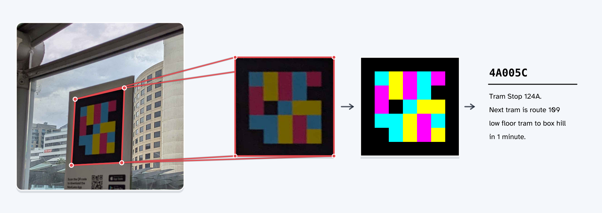

*FreeLens development continues. Interfaces and behaviour can change without notice.*

[FreeLens tag generator](https://freelens.sjtrny.com/)

# FreeLens

This project provides a reference implementation of [NaviLens](https://www.navilens.com/) and [ddTag](https://www.ddtags.com/) for educational or personal use. Commercial use is at your own risk. NaviLens and ddTag may attempt to enforce their intellectual property rights.

[](./docs/assets/freelens-pipeline.svg)

## Documentation

- [NaviLens](./docs/navilens.md)
- [ddTag specification](./docs/ddtag.md)
- [ddTag detection](./docs/ddtag-detection.md)
- [CRCs in ddTags](./docs/ddtag-crc.md)
- [Testing NaviLens code PDFs](./docs/testing-navilens-codes.md)
- [Dataset](./docs/dataset.md)
- [Tag editor](./docs/tag-editor.md)
- [Development](./docs/development.md)

## Quick start

### Installation

```
pip install freelens
```

### Generate tags

FreeLens generates 5×5, 7×7, 9×9, and 11×11 tags. A cyclic redundancy check (CRC) detects errors in the tag data. The 5×5 generator uses the CRC calculation found in deployed NaviLens tags.

Larger generators use the same method with the CRC width and polynomial for their grid size. No deployed examples are available to check the CRC calculation for these larger grids.

```python
from freelens import Tag

message = "101010101011000000001011"

tag = Tag.from_message(message, n=5)

tag_img = tag.to_image()

tag_img.save("tag.png")
```

Generated tags larger than 5×5 report an unknown CRC status:

```python
tag = Tag.from_message("0" * 64, n=7)
assert tag.crc_valid is None
```

### Detect tags

```python
from freelens import detect_tags
from PIL import Image

img = Image.open("dataset/images/0001.jpg")

tags_list = detect_tags(
    img,
    n=5,
    validate_crc=True,
    require_valid_crc=True,
)

for tag in tags_list:
    print(tag.message)
```
