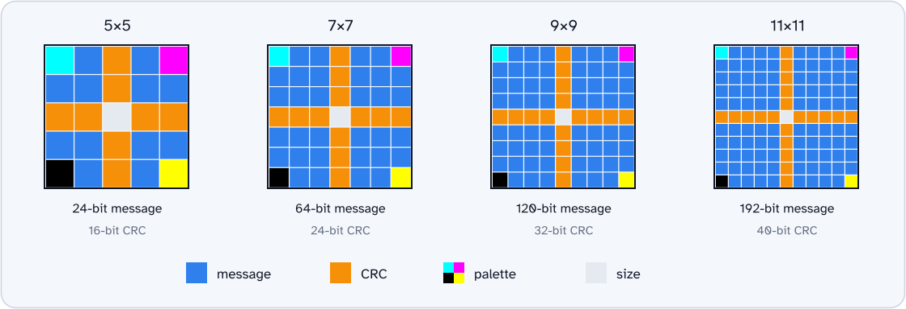
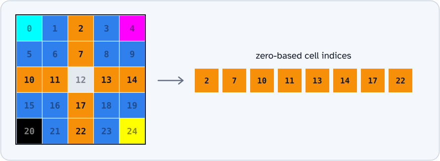
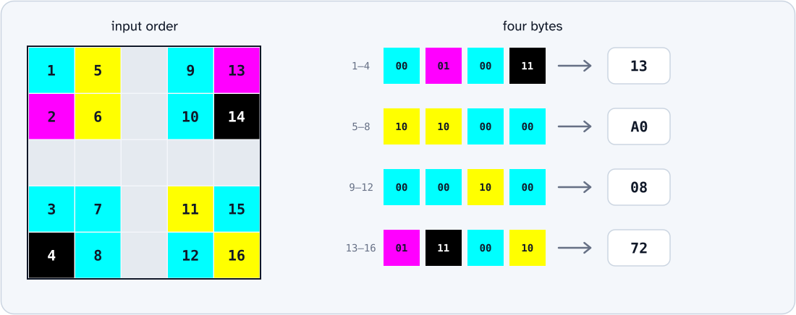
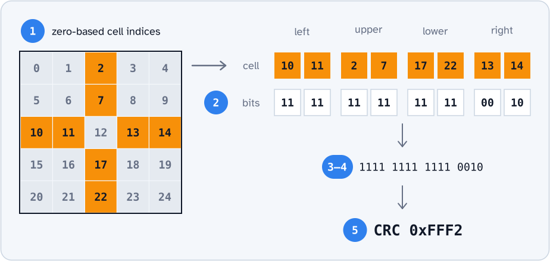

# CRCs in ddTags

## Patent CRC description

The patent gives this cell layout for a grid with width `N`:

- The center row and center column contain the CRC, except for the center cell.
- The CRC uses `2N - 2` cells and contains `4N - 4` bits.
- The four corner cells contain the palette colors.
- The center cell contains the grid size.
- All other cells contain the message.

The message contains `2N^2 - 4N - 6` bits. The patent gives a CRC calculation that uses only this message.

The patent gives the CRC cell order, but the message cell order is not clear. It also does not give a method to convert the message bits into bytes. Row-by-row order is possible, but the patent does not give this instruction.



### Polynomials and parameters

The patent gives a CRC name for each grid size. It uses the heading "CRC polynomials" for these names. It does not give the initial value, final XOR, or reflection settings.

The table below uses the standard CRC model for each name. The `check` value gives the CRC of the ASCII bytes `123456789` for comparison.

All four models use `refin=false` and `refout=false`. Each model processes the most-significant bit of each input byte first.

| Grid  |  Message |     CRC | Patent name     |         `poly` |         `init` |       `xorout` |        `check` |
| ----- | -------: | ------: | --------------- | -------------: | -------------: | -------------: | -------------: |
| 5x5   |  24 bits | 16 bits | CRC-16-CDMA2000 |       `0xC867` |       `0xFFFF` |       `0x0000` |       `0x4C06` |
| 7x7   |  64 bits | 24 bits | CRC-24-Radix-64 |     `0x864CFB` |     `0xB704CE` |     `0x000000` |     `0x21CF02` |
| 9x9   | 120 bits | 32 bits | CRC-32Q         |   `0x814141AB` |   `0x00000000` |   `0x00000000` |   `0x3010BF7F` |
| 11x11 | 192 bits | 40 bits | CRC-40-GSM      | `0x0004820009` | `0x0000000000` | `0xFFFFFFFFFF` | `0xD4164FC646` |

`CRC-24-Radix-64` is another name for `CRC-24/OPENPGP`. `CRC-32Q` is another name for `CRC-32/AIXM`.

The residue is zero for the 16-, 24-, and 32-bit models. The CRC-40/GSM residue is `0xC4FF8071FF`.

The hexadecimal `poly` value does not include the `x^width` term. The full generator polynomials are:

```text
CRC-16: x^16 + x^15 + x^14 + x^11 + x^6 + x^5 + x^2 + x + 1
CRC-24: x^24 + x^23 + x^18 + x^17 + x^14 + x^11 + x^10
        + x^7 + x^6 + x^5 + x^4 + x^3 + x + 1
CRC-32: x^32 + x^31 + x^24 + x^22 + x^16 + x^14 + x^8
        + x^7 + x^5 + x^3 + x + 1
CRC-40: x^40 + x^26 + x^23 + x^17 + x^3 + 1
```

### CRC cells

The patent gives this CRC cell order: from left to right, then from top to bottom. The table below gives the cell indices in that order. Cell indices start at zero.

| Grid  | CRC cell indices                                                                  |
| ----- | --------------------------------------------------------------------------------- |
| 5x5   | `2, 7, 10, 11, 13, 14, 17, 22`                                                    |
| 7x7   | `3, 10, 17, 21, 22, 23, 25, 26, 27, 31, 38, 45`                                   |
| 9x9   | `4, 13, 22, 31, 36, 37, 38, 39, 41, 42, 43, 44, 49, 58, 67, 76`                   |
| 11x11 | `5, 16, 27, 38, 49, 55, 56, 57, 58, 59, 61, 62, 63, 64, 65, 71, 82, 93, 104, 115` |



## Observed CRC

NaviLens 5x5 tags do not use the patent calculation. The sections below give the CRC calculation found by reverse engineering.

### Message order

The decoder reads the twelve message cells one column at a time. The two-bit values of these cells give the 24-bit message.


### CRC input

The CRC calculation uses all cells outside the center row and center column.

Join the two-bit cell values to make 32 bits. Divide the bits into four bytes, from left to right. Do not remove any leading zero bytes.



The CRC parameters for these tags are:

```text
width     = 16
poly      = 0xC867
init      = 0x0000
xorout    = 0x0000
refin     = false
refout    = false
check     = 0xE355
residue   = 0x0000
```

### CRC storage

A tag stores the 16-bit CRC in eight cells of the central cross. Each cell contains two bits. The center cell, at index `12`, does not contain CRC bits.

To read the stored CRC:

1. Read the cells in this order: `10, 11, 2, 7, 17, 22, 13, 14`.
1. Convert the palette color of each cell to its two-bit value.
1. Join the eight two-bit values to make a 16-bit binary number, with the most-significant bit first. Keep any leading zeros.
1. Convert the binary number to hexadecimal.

The arm order is left (`10, 11`), upper (`2, 7`), lower (`17, 22`), then right (`13, 14`). In each arm, the order is from left to right or from top to bottom. These indices identify cell positions, not bit values.

For the [example Melbourne tag](../dataset/images/0017.jpg), the eight cells contain `11 11 11 11 11 11 00 10`. The binary number is `1111111111110010`. This number is `0xFFF2` in hexadecimal.



## Examples

The [Melbourne tram tag](../dataset/images/0017.jpg) has these values:

```text
grid       00101100010110110011111100001000001110001100110010
message    010010100000000010001100
CRC input  00010011101000000000100001110010
bytes      13 A0 08 72
CRC        FFF2
```

Standard CRC-16/CDMA2000 gives `E751` for the message bytes `4A 00 8C`. This result is not equal to the stored CRC, `FFF2`.

The tag with message code `B1269C` has these values:

```text
grid       00001001011001011011001100011111001010001110100110
message    101100010010011010011100
CRC input  00101111000100100110100101110010
bytes      2F 12 69 72
CRC        39A7
```

The [5x5 CRC tests](../tests/test_crc_5x5.py) check these values, the cell order, the byte packing, and tag generation. The tests also check the CRC after a change to each type of cell.

## FreeLens

FreeLens generates all four tag sizes. It uses the CRC method from NaviLens 5x5 tags for larger grids, with these rules:

- The CRC input contains all cells outside the center row and center column, including the four corner cells.
- FreeLens reads the input cells by column, with the most-significant bit first in each byte.
- The CRC width is `4N - 4` bits. FreeLens uses the polynomial that the patent gives for each grid size.
- The parameters are `init=0`, `xorout=0`, `refin=false`, and `refout=false`.
- FreeLens stores the CRC in the left, upper, lower, and right arms of the central cross, in that order.

This method is different from the patent calculation. It uses the 5x5 layout and parameters with larger polynomial widths.

The tests include NaviLens tags only for the 5x5 size. The CRC status is unknown for generated 7x7, 9x9, and 11x11 tags:

```python
tag = Tag.from_message("0" * 64, n=7)
assert tag.crc_valid is None
```

To parse a larger tag, disable CRC validation:

```python
tag = Tag(bit_string, n=7, validate_crc=False)
```

The local `NaviLens Codes.zip` archive contains 142 PDF tags with 5x5 grids. The calculated CRC is equal to the stored CRC in all 142 tags.

The repository does not include the archive. The project needs permission to distribute it.

To check a local copy of the archive, run these commands:

```bash
python -m pip install -e ".[dataset,test]"
python scripts/verify_navilens_archive.py "/path/to/NaviLens Codes.zip"
```

## References

- [ddTag patent: EP 3561729 A1](https://data.epo.org/publication-server/rest/v1.0/publication-dates/20191030/patents/EP3561729NWA1/document.pdf)
- [CRC RevEng catalogue](https://reveng.sourceforge.io/crc-catalogue/)
- [FreeLens CRC implementation](../freelens.py)
