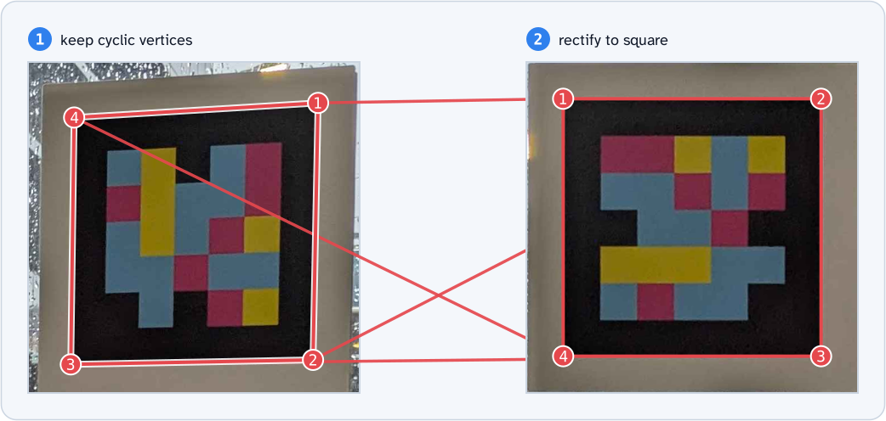
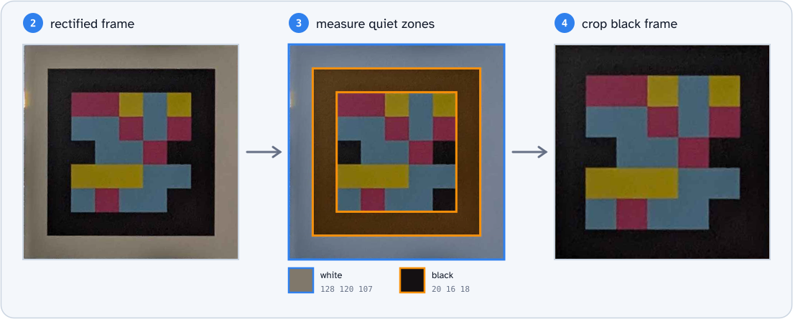
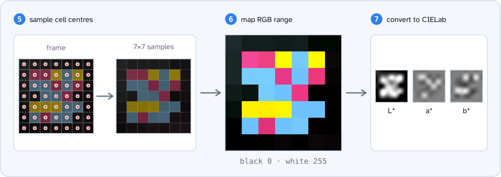
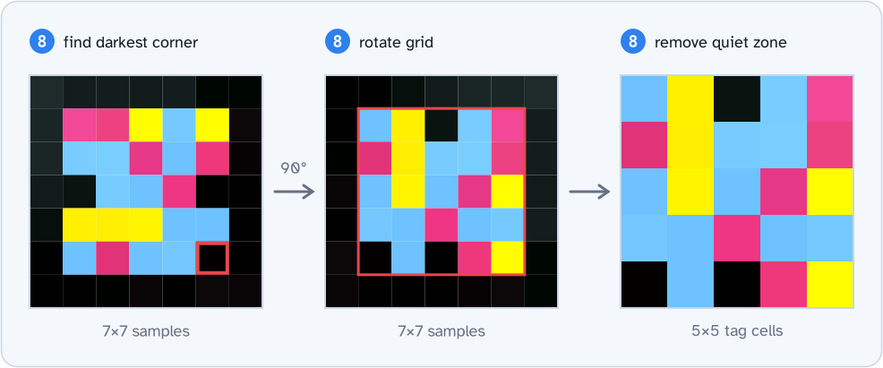
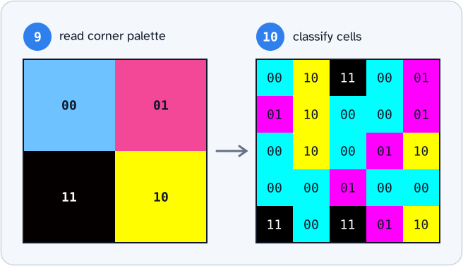
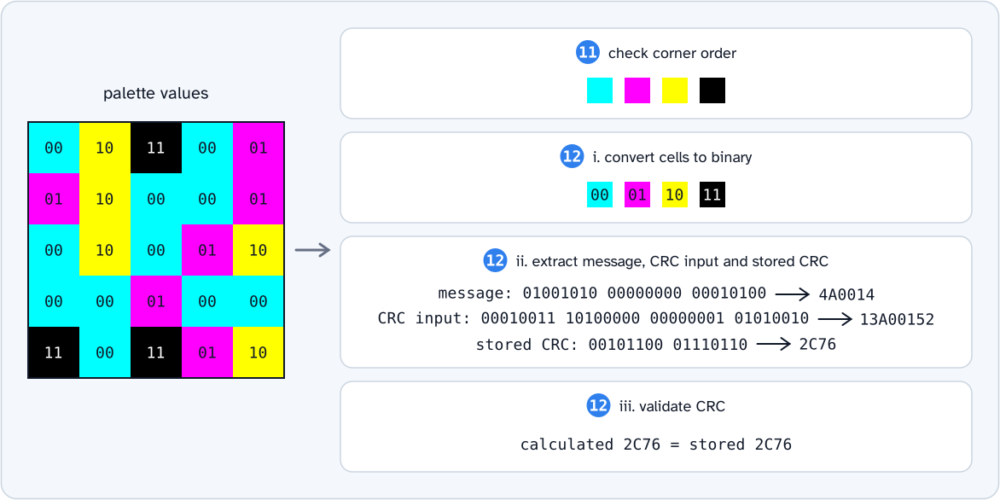

# Detection and decoding of ddTags

## Detect possible tags

A frame is the border of a possible tag. The ddTag patent does not specify a frame detector. It suggests the method in [Garrido-Jurado et al.][1].

The FreeLens `detect_frames` function uses an adapted method:

1. Convert the image to greyscale.
1. Apply local adaptive thresholding to identify boundaries.
1. Detect contours with Suzuki's method.
1. Remove contours with one or more of these conditions:
   - Fewer than four sampled boundary points
   - A bounding-box area of less than 1,500 px²
1. Fit a polygon to each remaining contour.
1. Keep only polygons with all four properties:
   - Four vertices
   - A minimum area of 1,500 px²
   - A convex shape
   - A roughly square shape, as measured by the perimeter-to-area test

### Steps 1–3

### Steps 3–4

Adaptive thresholding can produce many small contours. Polygon fitting and perimeter calculations take more time than the initial contour checks. The `contour_filter_candidates` function removes unsuitable contours first.

The function keeps contours with four or more points and a minimum bounding-box area of 1,500 px². A polygon with four vertices must have four or more contour points. Its area cannot be greater than the area of the contour's bounding box.

### Step 5

The initial contour checks do not fully check the polygon shape. The polygon filters must also check the vertex count, area, convexity, and shape.

### Step 6

## Decode possible tags

The decoder uses the palette and CRC rules from the patent, with the observed NaviLens CRC calculation for 5×5 tags. The steps and diagrams follow the FreeLens sampling order. The diagrams use the same [source photograph](../dataset/images/0004.jpg) as the detection examples.

For each frame polygon:

1. Keep the cyclic vertex order from the contour approximation.
1. Rectify the frame and the two quiet zones to a square image with a fixed size.
1. Measure the median black and white RGB values at fixed positions in the quiet zones.
1. Crop the image to the tag and its black inner quiet zone.
1. Sample the centre pixel of each cell, also in the black quiet zone.
1. Map the black and white references to the full RGB range for each sample.
1. Convert the corrected samples to CIELab colour space.
1. Rotate the sample grid so that its darkest palette corner is at the bottom left.
1. Get the palette colours from the four tag corners.
1. Assign each tag cell to the nearest palette colour in CIELab space.
1. If strict validation is enabled, check that the four corner values are different and in the required order.
1. If CRC validation is enabled for a 5×5 tag, use these substeps:
   <ol type="i">
     <li>Convert the cell colours to two-bit values. Use <code>00</code>, <code>01</code>, <code>10</code>, and <code>11</code> in clockwise order from the top-left palette corner.</li>
     <li>Extract the message, CRC input, and stored CRC as separate values.</li>
     <li>Compare the CRC calculated from the input with the stored CRC.</li>
   </ol>

### Steps 1–2

The cyclic vertex order keeps adjacent corners together. The first vertex can be one of the four corners. Step 8 corrects the orientation after sampling.

### Steps 2–4

The quiet-zone references use only pixels in the source image. If either ring has no valid samples, the decoder keeps the initial RGB values unchanged.

### Steps 5–7

For a 5×5 tag, the frame contains 7×7 cells: the tag grid and its black quiet zone. FreeLens samples their centres before colour correction. It corrects only these 49 samples, not all pixels in the frame. The RGB correction and CIELab conversion operate on each pixel independently, so this order gives the same sample values.

### Step 8

The darkest palette corner identifies the orientation. It is a corner of the 5×5 tag grid, not of the 7×7 sample grid. In this example, the decoder rotates the grid 90° clockwise. After rotation, the decoder uses only the inner 5×5 samples for the tag cells. The black quiet-zone samples do not supply message or CRC bits.

### Steps 9–10

The diagrams use RGB colours to show the samples. The decoder compares their CIELab values.

### Steps 11–12

The message contains 24 bits. The CRC input contains 32 bits: the message bits and the eight palette corner bits. The central cross stores a separate 16-bit CRC. Refer to [CRCs in ddTags](./ddtag-crc.md) for the input and storage orders.

## References

Garrido-Jurado, S., et al. (2014). [Automatic generation and detection of highly reliable fiducial markers under occlusion][1]. Pattern Recognition.

[1]: https://cs-courses.mines.edu/csci507/schedule/24/ArUco.pdf
