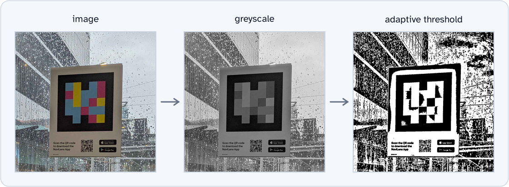
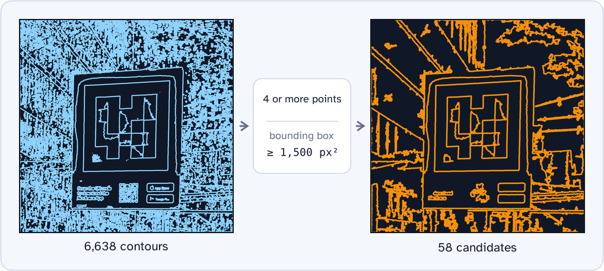
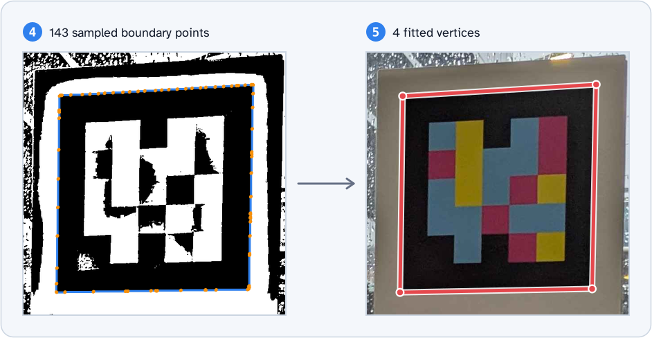
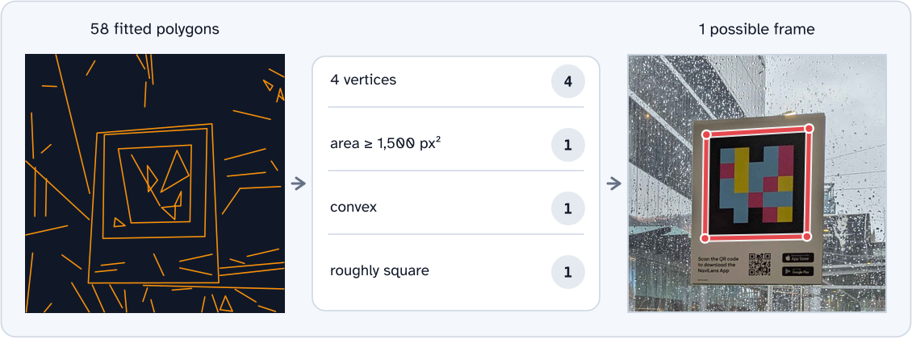

# Detection and Decoding of ddTags

## Detecting Possible Tags

The ddTag patent does not describe a particular process for detecting "frames" and
leaves it up to the implementor. However it suggests that the method in [1] may be used.

In `detect_frames` we use a modified version of [1] as follows:

1. Convert image to grayscale
1. Detect edges by local adaptive thresholding
1. Detect contours by Suzuki's method
1. Remove contours that cannot possibly become a frame:
   1. Raw contours with fewer than four sampled boundary points
   1. Contours whose bounding box covers less than 1,500 px²
1. Fit polygon to contours
1. Apply filters:
   1. 4-vertex polygons
   1. Area of at least 1,500 px²
   1. Convex polygon
   1. Shape is roughly square (perimeter/area test)

`contour_filter_candidates` performs the inexpensive checks before fitting polygons.
Adaptive thresholding can produce many small contours, and calculating the perimeter and
fitting a polygon to each one is comparatively expensive.

The early checks are conservative: a four-vertex polygon cannot be fitted from fewer
than four contour points, and a fitted polygon cannot have a larger area than the
contour's bounding box. The contour points are not polygon corners; the number of
corners is known only after polygon fitting.

The full polygon filters are therefore still required to check the fitted polygon's
vertex count, exact area, convexity, and shape.

The quiet zone is not used to reject frame candidates. Every candidate is colour
calibrated using median RGB values from its black and white rings. When either ring
cannot be sampled, identity references preserve the original RGB values.

## Decoding Possible Tags

This process is adapted from the patent.

For each un-rectified frame polygon:

1. Preserve the cyclic vertex order produced by contour approximation. The first vertex
   can be any corner because tag orientation is normalised after sampling.
1. Un-warp the RGB frame and both quiet-zone rings to square aspect ratio and resize
   them to a fixed size
1. Measure median black and white RGB references from fixed positions in the rectified
   quiet-zone rings, excluding pixels that fall outside the source image
1. Crop the rectified image to the black-framed tag region
1. Map the measured black and white RGB references onto the full RGB range
1. Convert the corrected frame image to CIELab colour space
1. Get the cell colours from the center positions of each cell in the grid
1. Rotate the sampled grid so its darkest corner is at the bottom left
1. Obtain the palette colours from the four corners of the grid
1. Assign each cell in the grid to the closest colour in the palette
1. When strict validation is enabled, require the four reserved corner cells to have
   distinct palette values in canonical order
1. Validate the deployed CRC when processing a 5×5 tag and validation is enabled
   1. Convert cells to binary using the rule that the palette is ordered clockwise
      starting at the top left with the binary values `00`, `01`, `10`, `11`.
   1. Extract message code and CRC code.
   1. Validate message code with CRC code.

## References

Garrido-Jurado, S., et al. (2014).
[Automatic generation and detection of highly reliable fiducial markers under occlusion][1].
Pattern Recognition.

[1]: https://cs-courses.mines.edu/csci507/schedule/24/ArUco.pdf
