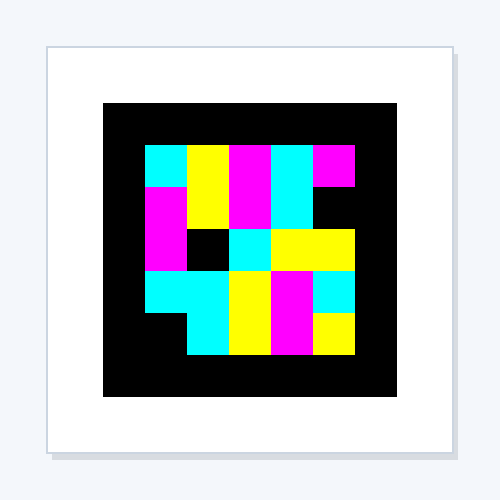
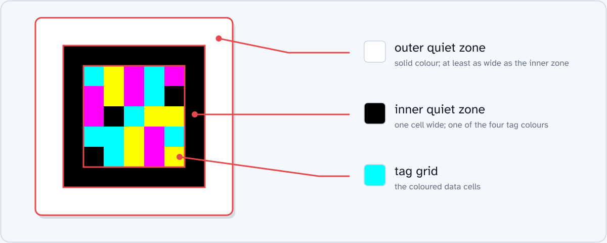
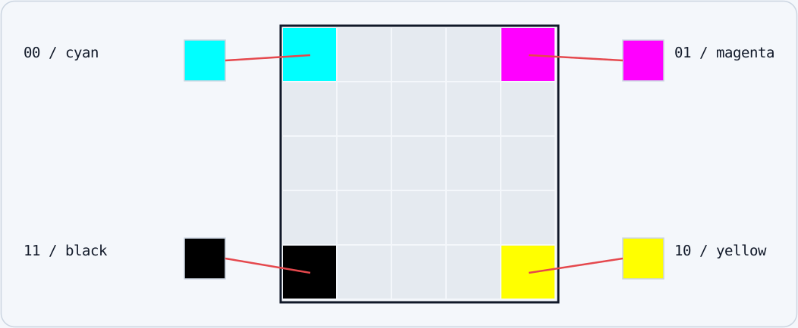
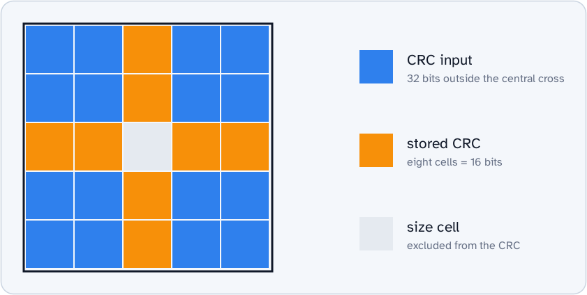
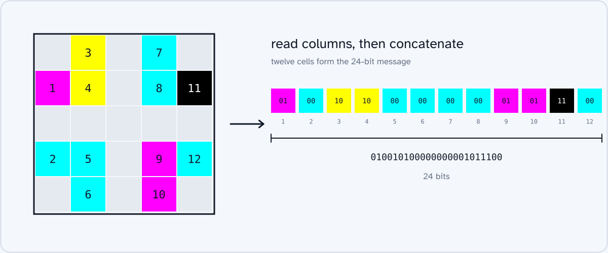

## ddTag specification

A ddTag is a small square grid of coloured cells. The 5×5 grid contains a 24-bit message. Its cells use cyan, magenta, yellow, and black.

The tag contains a binary message and a cyclic redundancy check (CRC). The CRC detects errors in the tag data. The tag also has cells for the colour palette and grid size.

The ddTag specification gives four grid sizes:

- 5×5
- 7×7
- 9×9
- 11×11

The tag has three parts, in this order from the outer border to the centre:

1. Outer quiet zone
1. Inner quiet zone
1. Tag grid

### Quiet zones

The outer quiet zone is a solid-colour border, usually white. For best detection results, its width must be equal to or greater than the inner quiet-zone width.

The inner quiet zone is also a solid-colour border. It must use one of the four tag colours, usually black. Its width must equal the width of one grid cell.

### Grid

Each cell has one of four colours. Each colour represents a two-bit value: `00`, `01`, `10`, or `11`.

The grid has an odd number of rows and columns. This gives it a centre cell, centre row, and centre column:

- The centre cell contains the grid size.
- The centre row and centre column contain the CRC. The centre cell does not contain CRC bits.

#### Corners and colours

The four corner cells define the colour palette. They do not contain message bits. Each corner must have a different colour.

The bottom-left corner must have the darkest colour, usually black. The decoder uses this corner to find the tag orientation.

The bit values are `00`, `01`, `10`, and `11`, in clockwise order from the top-left corner. If the top-left corner is cyan, all cyan cells have the value `00`.

#### Centre cell

The centre cell does not contain message or CRC bits. The patent uses this cell to encode the grid size:

| Grid  | Centre cell |
| ----- | ----------- |
| 5×5   | cyan        |
| 7×7   | magenta     |
| 9×9   | yellow      |
| 11×11 | black       |

#### CRC

The CRC input and the stored CRC are different. The input is the data used to calculate the CRC. The stored CRC is the result that the tag contains for comparison.

The patent specifies a CRC calculation that uses only the message bits. Deployed NaviLens 5×5 tags use 32 input bits: 24 message bits and eight palette corner bits.

For a 5×5 tag, the two layouts store the 16-bit CRC in eight cells of the central cross. The centre cell is not part of the CRC input or storage. The corner cells supply CRC input bits; they do not store CRC bits.

Refer to [CRCs in ddTags](./ddtag-crc.md) for the cell order and calculation.

#### Message

The message uses the cells that are not in the central cross or the four corners. Each message cell supplies two bits.

The patent describes the order as:

> from left to right and from top to bottom

This description does not clearly specify which to read first: rows or columns. NaviLens tags use column order. FreeLens uses the same order for compatibility.

Read the message cells from top to bottom in each column. Read the columns from left to right. Join their two-bit values to get the message.

The numbers in this diagram are read positions, from 1 to 12. They are not grid cell indices.

## References

European Patent [EP3561729NWA1][1]

[1]: https://data.epo.org/publication-server/rest/v1.0/publication-dates/20191030/patents/EP3561729NWA1/document.pdf
