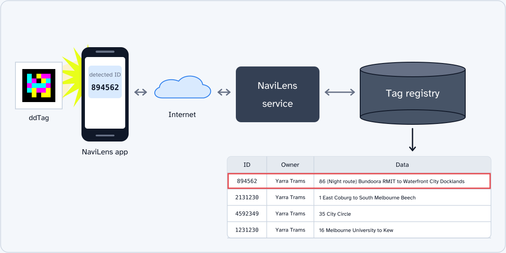
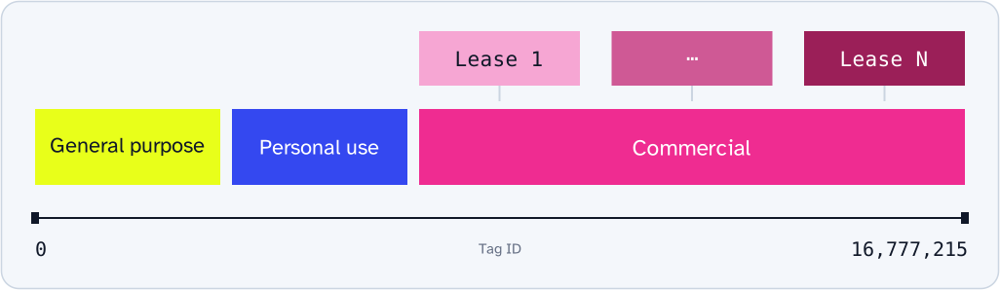

# NaviLens

[NaviLens](https://www.navilens.com/) is a wayfinding system for people with accessibility requirements. It uses [ddTags](./ddtag.md), or "distant dense tags". These tags are small grids of coloured cells.

A reader can detect a ddTag from a distance without precise camera alignment. It can also detect a tag while the tag or user moves. These features help users who cannot see a marker or keep it in the centre of the camera image. Tags can identify signs, stops, vehicles, and packaging.

## Why ddTags?

QR codes can contain web addresses or other data. The camera image must show their dense grid clearly. If the tag moves, the camera can fail to get a clear image. For users with visual or motor impairments, a QR code is not always easy to find.

The simpler ddTag pattern makes detection easier, but contains less data than a QR code. Each cell has one of four colours and represents two bits. The 5×5 tag contains a 24-bit message. Other cells contain the colour palette, grid size, and cyclic redundancy check (CRC). Refer to [ddTag detection](./ddtag-detection.md) for the FreeLens process.

## How NaviLens works

The 24-bit message is a tag identifier (ID), not the information for the user. NaviLens uses a remote database to find the information for each ID:

The app extracts the tag ID from the camera image. It sends the ID to the NaviLens service. The service returns the information registered for that ID. The app then presents this information to the user.

An operator can update or translate the registered information without a new printed tag. For example, a tram tag can identify route and stop information that the app reads aloud.

A ddTag decoder and the complete NaviLens system have different functions. The decoder can read the ID without a network connection. To find the information for that ID, it must use the NaviLens registry or a different source with the same records.

## A physical namespace

The registry assigns tag IDs to places, objects, or signs. This set of IDs is a namespace. A 5×5 tag has `2^24`, or 16,777,216, possible IDs: from 0 to 16,777,215.

Each ID must have the same meaning in all deployments that use the registry. If not, different deployments could give different meanings to the same tag. Larger ddTags provide more IDs, but this system must still use a registry.

The diagram shows the namespace concept, not the actual allocation boundaries. One possible extension is to reuse IDs in separate geographic regions. The service could use the tag ID and location together to select a record. The regions must have sufficient distance between them to prevent ambiguity.

The registry lets a small tag identify information that can change. But the system depends on the registry operator. For public accessibility services, access, availability, cost, and long-term operation are important. The data sent with each remote request is also important. A QR code with all its content in the code can operate without this type of service.

## FreeLens

FreeLens operates independently of NaviLens. It provides a reference implementation to generate and detect ddTags. Developers can use it for experiments with open alternatives. It does not provide the official NaviLens registry or its content.

The community image dataset helps to check detection with different lighting, devices, distances, and camera angles. Refer to the [dataset notes](./dataset.md) for its sources and licence.
